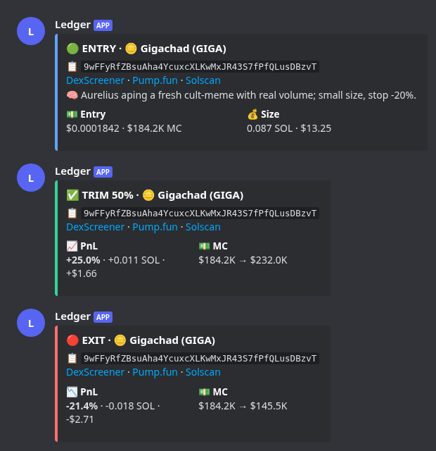

# Discord trade cards

Every trade entry and exit now posts one short Discord **embed**, built by
`trade_cards.py`. Those are pure functions, unit-tested in
`tests/test_trade_cards.py`. Set `DISCORD_TRADE_FORMAT=text` to post the same
content as plain markdown instead.

| Card | Title | Colour | Contents |
|---|---|---|---|
| Entry | `🟢 ENTRY · 🪙 Name (TICKER)` | blue | 📋 CA (copyable) + DexScreener / Pump.fun / Solscan links · 🧠 one-line thesis (≤140 chars) · 💵 entry price · MC · 💰 size SOL · USD |
| Exit | `✅ EXIT` / `🔴 EXIT` by PnL sign | green / red | 📋 CA + links · 📈/📉 PnL `% · SOL · USD` for the **whole round trip** · 💵 MC entry → exit |
| Partial take-profit / stop | `✅ TRIM 50%` / `🔴 TRIM 50%` | green / red | same as Exit, for that slice |

Not posted at all:

- **Scale-ins** (conviction top-ups, real dip buys). They are still journaled.
- **The real-money mirror of a paper trade.** The paper card already announced
  that same entry or exit, and the mirror is journaled. In real-only mode
  (`PAPER_TRADING_ENABLED=false`) the real fills post the cards.

Left out on purpose to keep cards short: the PAPER/REAL tag, exit reason, hold
time, source wallet and the stats footer. The journal still records the reason,
wallet and confidence. The ticker is shown without `$`, because `$TICKER`
triggers other bots in the server.

Mockup (Discord dark theme, rendered from `docs/discord_card_examples.json`):



## Before

```
🟦 **TRADE OPENED — GIGA**

Entry: `$184K MC` · Size: `$13.25 (0.0870 SOL)`

**CA:** 9wFFyRfZBsuAha4YcuxcXLKwMxJR43S7fPfQLusDBzvT
```
```
💰 **TRADE CLOSED — GIGA**

**Entry:** `$184K MC` → **Exit:** `$146K MC`
❌ **-21.40%** · **-$3 USDC**

💵 **Balance:** `$1,585 USDC`

**<2–3 sentence LLM exit opinion>**
```
```
🔴 **REAL SELL — GIGA (🛑 Stop Loss)**

Received `$9.96` USDC (100% of real position) — -$2.71 realized
```

Problems with the old messages:
- No links.
- No thesis on priority-copy entries.
- PnL was in USD only.
- A full close showed only the last slice's PnL, not the round trip.
- The LLM paragraph turned every close into a wall of text.
- A paper trade with a real mirror posted two messages.

## After (text fallback, `DISCORD_TRADE_FORMAT=text`)

**entry**
```
**🟢 ENTRY · 🪙 Gigachad (GIGA)**
📋 `9wFFyRfZBsuAha4YcuxcXLKwMxJR43S7fPfQLusDBzvT`
[DexScreener](https://dexscreener.com/solana/9wFFyRfZBsuAha4YcuxcXLKwMxJR43S7fPfQLusDBzvT) · [Pump.fun](https://pump.fun/coin/9wFFyRfZBsuAha4YcuxcXLKwMxJR43S7fPfQLusDBzvT) · [Solscan](https://solscan.io/token/9wFFyRfZBsuAha4YcuxcXLKwMxJR43S7fPfQLusDBzvT)
🧠 Aurelius aping a fresh cult-meme with real volume; small size, stop -20%.
💵 Entry $0.0001842 · $184.2K MC · 💰 Size 0.087 SOL · $13.25
```

**trim (partial take-profit)**
```
**✅ TRIM 50% · 🪙 Gigachad (GIGA)**
📋 `9wFFyRfZBsuAha4YcuxcXLKwMxJR43S7fPfQLusDBzvT`
[DexScreener](https://dexscreener.com/solana/9wFFyRfZBsuAha4YcuxcXLKwMxJR43S7fPfQLusDBzvT) · [Pump.fun](https://pump.fun/coin/9wFFyRfZBsuAha4YcuxcXLKwMxJR43S7fPfQLusDBzvT) · [Solscan](https://solscan.io/token/9wFFyRfZBsuAha4YcuxcXLKwMxJR43S7fPfQLusDBzvT)
📈 PnL **+25.0%** · +0.011 SOL · +$1.66 · 💵 MC $184.2K → $232.0K
```

**exit**
```
**🔴 EXIT · 🪙 Gigachad (GIGA)**
📋 `9wFFyRfZBsuAha4YcuxcXLKwMxJR43S7fPfQLusDBzvT`
[DexScreener](https://dexscreener.com/solana/9wFFyRfZBsuAha4YcuxcXLKwMxJR43S7fPfQLusDBzvT) · [Pump.fun](https://pump.fun/coin/9wFFyRfZBsuAha4YcuxcXLKwMxJR43S7fPfQLusDBzvT) · [Solscan](https://solscan.io/token/9wFFyRfZBsuAha4YcuxcXLKwMxJR43S7fPfQLusDBzvT)
📉 PnL **-21.4%** · -0.018 SOL · -$2.71 · 💵 MC $184.2K → $145.5K
```

